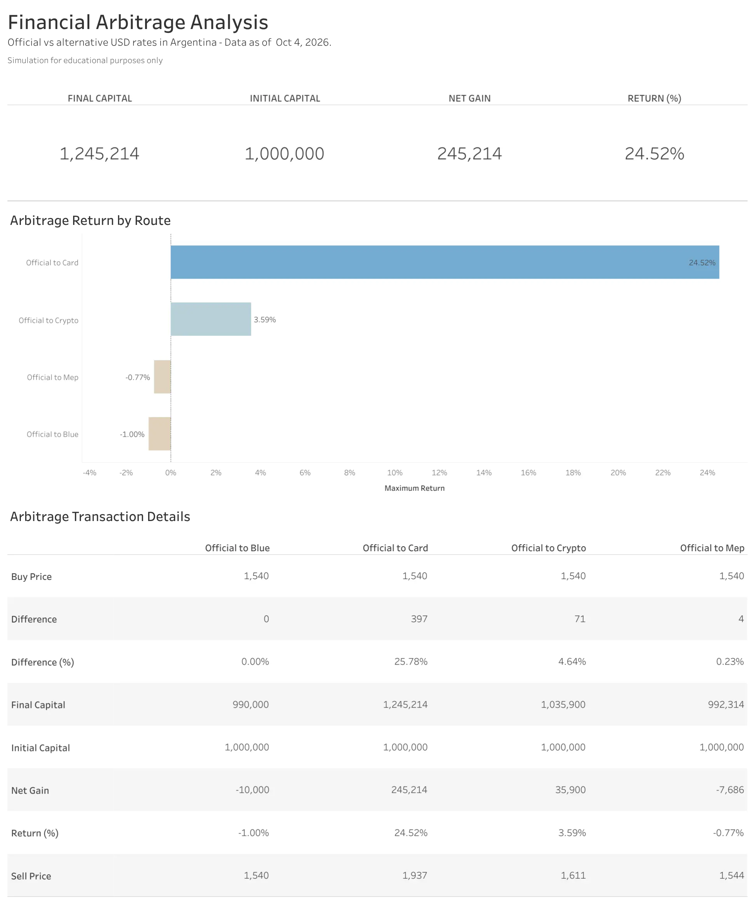

# Financial Arbitrage Analysis (Argentina)

A Python + Tableau project that compares the official USD exchange rate in Argentina with alternative rates (Blue, MEP, Crypto and Card) to see which route would have produced the highest return on a fixed amount of pesos.

> **Disclaimer:** this is a simulation for learning and portfolio purposes. It uses the day's quoted prices and a flat 1% commission. It ignores trading limits, taxes, delays and real-world restrictions, and it is not financial advice.

## What it does

1. Pulls live exchange rates from [DolarAPI](https://dolarapi.com).
2. Simulates buying USD at the official rate and selling them through each alternative route.
3. Calculates, for every route: price difference, difference (%), net result, return (%) and final capital.
4. Saves the results to a CSV file (one row per route, appended on every run).
5. The CSV feeds a Tableau dashboard.

## Routes analyzed

| Route | Description |
|---|---|
| Official to Blue | Buy at the official rate, sell at the informal (blue) rate |
| Official to Mep | Buy at the official rate, sell at the MEP (bonds) rate |
| Official to Crypto | Buy at the official rate, sell at the crypto rate |
| Official to Card | Reference only: the card rate is the price paid for purchases abroad, not a rate at which USD can be sold |

## Dashboard

[View the dashboard on Tableau Public](https://public.tableau.com/app/profile/dalma.quiroga/viz/FinancialArbitrageAnalysis/Dashboard1)



## How to run

```bash
pip install requests
python arbitrage_analysis.py
```

The script asks for an initial capital in ARS (press Enter to use 1,000,000), prints a report for each route and appends the results to `resultados_arbitraje.csv`.

## Output columns

`Date & Time`, `Performance Type`, `Route`, `Buy Price`, `Sell Price`, `Difference`, `Difference (%)`, `Result`, `Return (%)`, `Initial Capital`, `Net Gain`, `Final Capital`

## Tools

- Python (`requests`, `csv`, `datetime`)
- DolarAPI
- Tableau Public

## Author

Dalma Quiroga
